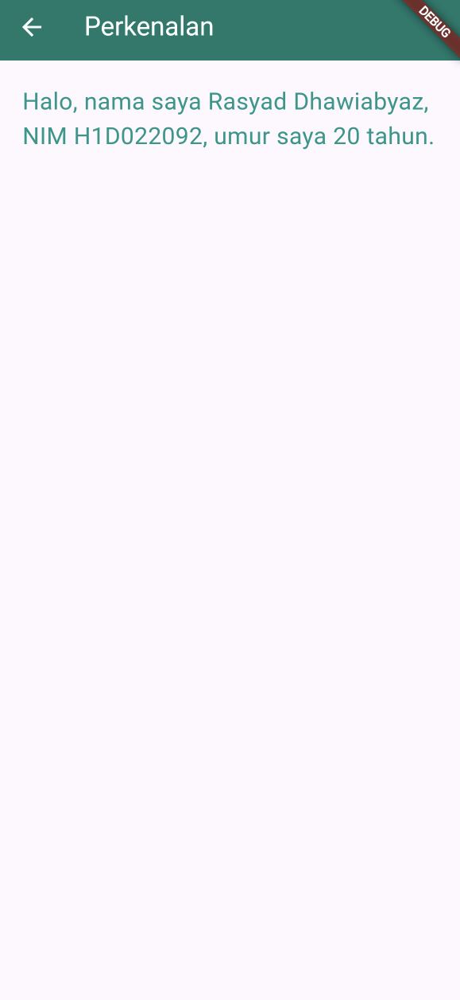

# Tugas Pertemuan 2

Proses Passing Data dari Form Menuju Tampilan

Di dalam aplikasi ini, terdapat form input (`FormData`) yang berfungsi untuk mengumpulkan data dari pengguna. Form ini terdiri dari beberapa `TextField` yang digunakan untuk menerima input data seperti `nama`, `NIM`, dan `tahun lahir`. Setelah pengguna memasukkan data ke dalam form, data tersebut akan diproses dan dikirim ke halaman tampilan menggunakan `Navigator`.

`TextEditingController` digunakan untuk mengelola dan mendapatkan nilai input dari setiap `TextField`.

Setiap TextField memiliki controller yang terhubung:
```
final _namaController = TextEditingController();
final _nimController = TextEditingController();
final _tahunController = TextEditingController();
```
Ketika tombol Simpan ditekan, data dari controller ini akan diambil:
```
String nama = _namaController.text;
String nim = _nimController.text;
int tahun = int.parse(_tahunController.text);
```
Setelah pengguna mengisi form dan menekan tombol Simpan, data yang diinput akan dikirimkan ke halaman `TampilData` menggunakan fungsi `Navigator.push`.

Proses ini melibatkan penggunaan Route untuk berpindah dari satu halaman ke halaman lain dengan membawa data:
```
Navigator.of(context).push(
  MaterialPageRoute(
    builder: (context) =>
      TampilData(nama: nama, nim: nim, tahun: tahun),
  ),
);
```
Di dalam `TampilData`, data yang diterima dari halaman form (nama, nim, dan tahun) ditampilkan dalam bentuk teks pada layar.

`TampilData` menerima data melalui parameternya:
```
class TampilData extends StatelessWidget {
  final String nama;
  final String nim;
  final int tahun;

  const TampilData({
    Key? key,
    required this.nama,
    required this.nim,
    required this.tahun,
  }) : super(key: key);
```
Data tersebut kemudian diolah dan ditampilkan dalam `Text` widget:
```
final int umur = DateTime.now().year - tahun;

return Scaffold(
  body: Center(
    child: Text(
      "Nama saya $nama, NIM $nim, dan umur saya adalah $umur tahun",
      textAlign: TextAlign.center,
      style: TextStyle(fontSize: 24),
    ),
  ),
);
```

## Screenshot


